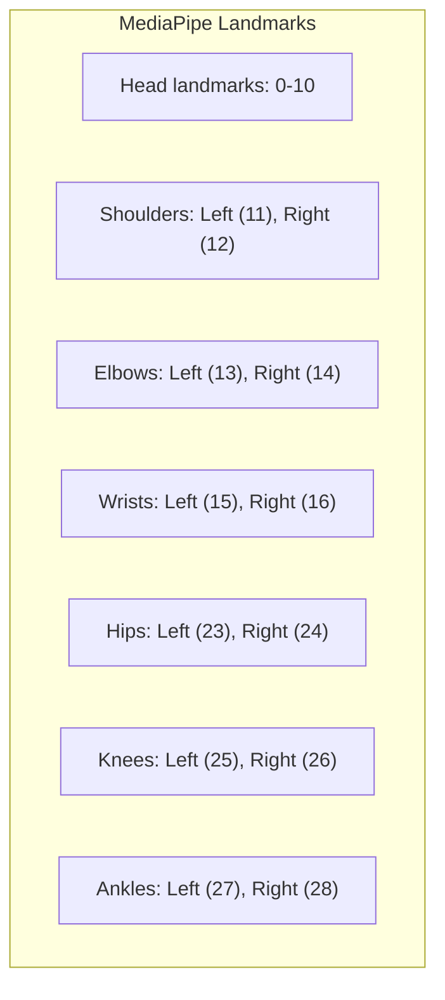

# Coach Compiler Developer Documentation

This document compiles the official technical specifications, APIs, and integration guides required to build the **Coach Compiler** (v0.1) platform. It provides a comprehensive developer reference based on the official Google AI and MediaPipe documentation referenced in the project specifications.

---

## Table of Contents

1. [Gemini Live API Overview](#1-gemini-live-api-overview)
2. [WebSocket Integration & Streaming](#2-websocket-integration--streaming)
3. [Structured Outputs](#3-structured-outputs)
4. [Function Calling for UI Actions](#4-function-calling-for-ui-actions)
5. [Google Search Grounding](#5-google-search-grounding)
6. [Video & YouTube Understanding](#6-video--youtube-understanding)
7. [Gemini Thinking Configuration](#7-gemini-thinking-configuration)
8. [URL Context](#8-url-context)
9. [MediaPipe Pose Landmarker](#9-mediapipe-pose-landmarker)

---

## 1. Gemini Live API Overview

The **Gemini Live API** enables low-latency, bidirectional real-time voice and vision interactions. Unlike static request-response loops, it maintains a stateful connection to stream continuous audio, image, and text inputs, returning immediate, human-like spoken audio and text responses.

### Key Capabilities
* **Barge-in (Interruptions):** Users can interrupt the model at any point during spoken responses. The model immediately ceases audio generation and processes the new incoming stream.
* **Affective Dialog:** Adapts spoken tone, pace, and response style to match the user's input expressions and emotional cues.
* **Audio Transcriptions:** Automatically provides synchronized text transcripts of both user audio input and model audio output.
* **Tool Integration:** Supports both standard Google Search grounding and client-side custom tools (function calling) over the active stream.
* **Multilingual Support:** Supports low-latency voice interactions across 70+ languages.

### Technical Specifications
| Category | Specifications / Formats |
| :--- | :--- |
| **Protocol** | Stateful Secure WebSockets (`wss://`) |
| **Input Modalities** | Audio, Video (Image frames), Text |
| **Output Modalities** | Audio (Native generation), Text |
| **Input Audio Format** | Raw 16-bit PCM, 16kHz, Little-Endian, Mono |
| **Output Audio Format** | Raw 16-bit PCM, 24kHz, Little-Endian, Mono |
| **Input Video Format** | JPEG or PNG image frames (Max 1 FPS recommended for real-time) |

---

## 2. WebSocket Integration & Streaming

To build a low-latency browser or backend voice-coach session, connect directly to the Gemini Live WebSocket endpoint.

### Endpoint Configurations
Depending on environment safety and deployment rules, use one of the two following access methods:

#### A. Standard API Key (Backend/Development Only)
Connect to the `v1beta` service endpoint, passing the API key as a query parameter:
```text
wss://generativelanguage.googleapis.com/ws/google.ai.generativelanguage.v1beta.GenerativeService.BidiGenerateContent?key=YOUR_API_KEY
```

#### B. Ephemeral Tokens (Production/Client-to-Server)
To mitigate security risks on client devices (preventing API key exposure), generate a short-lived token on your backend and connect to the `v1alpha` endpoint:
```text
wss://generativelanguage.googleapis.com/ws/google.ai.generativelanguage.v1alpha.GenerativeService.BidiGenerateContentConstrained?access_token=YOUR_SHORT_LIVED_TOKEN
```

### Protocol Flow & JSON Message Spec
All client-server messages correspond to the `BidiGenerateContentClientMessage` and `BidiGenerateContentServerMessage` schemas.

#### 1. Setup Phase
The first message sent by the client must be a `setup` configuration payload:

```json
{
  "setup": {
    "model": "models/gemini-2.5-flash",
    "generationConfig": {
      "responseModalities": ["AUDIO"]
    },
    "systemInstruction": {
      "parts": [
        {
          "text": "You are a friendly, encouraging golf coach. Keep corrective cues concise."
        }
      ]
    }
  }
}
```

#### 2. Streaming Client Input
Audio chunks and image frames are sent as base64-encoded strings wrapped in the `realtimeInput` object.

##### Sending Text
```json
{
  "realtimeInput": {
    "text": "Explain what low-point contact means."
  }
}
```

##### Sending Audio (16kHz Raw PCM base64-encoded)
```json
{
  "realtimeInput": {
    "mediaChunks": [
      {
        "mimeType": "audio/pcm;rate=16000",
        "data": "UklGRiQAAABXQVZFZm10IBIAAA..."
      }
    ]
  }
}
```

##### Sending Video (JPEG Image Frame base64-encoded)
```json
{
  "realtimeInput": {
    "mediaChunks": [
      {
        "mimeType": "image/jpeg",
        "data": "/9j/4AAQSkZJRgABAQAAAQABAAD..."
      }
    ]
  }
}
```

#### 3. Handling Server Responses
The server streams response chunks containing audio transcripts or base64 PCM data.

```json
{
  "serverContent": {
    "modelTurn": {
      "parts": [
        {
          "mimeType": "audio/pcm;rate=24000",
          "inlineData": {
            "mimeType": "audio/pcm;rate=24000",
            "data": "UklGRiQAAABXQVZFZm10IBIAAA..."
          }
        }
      ]
    }
  }
}
```

### Integration Snippets

#### JavaScript (Browser Client Connection)
Do not ship this pattern with a real long-lived API key in browser code. Use it only as a protocol sketch, or replace it with a backend-issued ephemeral token flow before any shared demo or deployment.

```javascript
const API_KEY = "YOUR_API_KEY";
const MODEL_NAME = "gemini-2.5-flash";
const WS_URL = `wss://generativelanguage.googleapis.com/ws/google.ai.generativelanguage.v1beta.GenerativeService.BidiGenerateContent?key=${API_KEY}`;

const socket = new WebSocket(WS_URL);

socket.onopen = () => {
  console.log("WebSocket Connected");
  
  // Send Setup Configuration
  const setupMessage = {
    setup: {
      model: `models/${MODEL_NAME}`,
      generationConfig: {
        responseModalities: ["AUDIO"]
      },
      systemInstruction: {
        parts: [{ text: "You are a professional golf instructor coaching a fat shot corrective drill." }]
      }
    }
  };
  socket.send(JSON.stringify(setupMessage));
};

socket.onmessage = (event) => {
  const response = JSON.parse(event.data);
  console.log("Received server message:", response);
  
  if (response.serverContent?.modelTurn?.parts) {
    for (const part of response.serverContent.modelTurn.parts) {
      if (part.inlineData && part.inlineData.mimeType.startsWith("audio/pcm")) {
        // Output raw PCM audio data chunk to a speaker node / AudioContext
        playAudioChunk(part.inlineData.data);
      }
    }
  }
};

function sendAudioChunk(arrayBuffer) {
  if (socket.readyState === WebSocket.OPEN) {
    const base64Data = arrayBufferToBase64(arrayBuffer);
    const audioMessage = {
      realtimeInput: {
        mediaChunks: [
          {
            mimeType: "audio/pcm;rate=16000",
            data: base64Data
          }
        ]
      }
    };
    socket.send(JSON.stringify(audioMessage));
  }
}
```

---

## 3. Structured Outputs

For pipeline steps such as **Intent Parser**, **Researcher**, **Scientific Validator**, and **Skill Compiler**, we enforce strict type safety and JSON consistency using Structured Outputs. This eliminates the brittleness of regex parsing.

### How it Works
We supply a target schema during model initialization. The model guarantees that the generated response JSON string conforms exactly to the defined structure.

### Zod Integration Snippet (TypeScript)
```typescript
import { GoogleGenAI, ThinkingLevel } from "@google/genai";
import { z } from "zod";
import { zodToJsonSchema } from "zod-to-json-schema";

const ai = new GoogleGenAI({ apiKey: process.env.GEMINI_API_KEY });

// Define Zod Intent Schema
const IntentSchema = z.object({
  activity: z.string(),
  goal: z.string(),
  skillLevel: z.enum(["beginner", "intermediate", "advanced", "unknown"]),
  environment: z.string(),
  equipment: z.array(z.string()),
  durationMinutes: z.number(),
  constraints: z.array(z.string()),
  painFlags: z.array(z.string()),
  successMetric: z.string(),
  needsSafetyScreen: z.boolean()
});

export async function parseIntent(transcript: string): Promise<z.infer<typeof IntentSchema>> {
  const response = await ai.models.generateContent({
    model: "gemini-2.5-flash",
    contents: `Parse movement request: "${transcript}"`,
    config: {
      thinkingConfig: {
        thinkingLevel: ThinkingLevel.LOW
      },
      responseFormat: {
        type: "application/json",
        responseSchema: zodToJsonSchema(IntentSchema)
      }
    }
  });

  return IntentSchema.parse(JSON.parse(response.text ?? "{}"));
}
```

---

## 4. Function Calling for UI Actions

The Live Voice Coach coordinates UI changes (e.g., highlighting a cue, updating reps) dynamically by triggering client-side functions.

### Protocol Mechanics
1. **Declare Tools:** The client registers function descriptors in the `setup` message.
2. **Model Call:** If the model determines a tool is needed, it pauses audio output and returns a `toolCall` payload.
3. **Execute & Return:** The client executes the matching UI logic and sends a `toolResponse` back to resume model thinking.

### Zod / API Tool Definitions
```typescript
const uiTools = [
  {
    functionDeclarations: [
      {
        name: "showCueCard",
        description: "Display a specific corrective movement cue card on the screen.",
        parameters: {
          type: "OBJECT",
          properties: {
            cue: { type: "STRING", description: "The corrective cue text (e.g., 'sternum over line')" },
            emphasis: { type: "STRING", description: "Visual highlight color keyword (e.g., 'primary', 'warning')" }
          },
          required: ["cue"]
        }
      },
      {
        name: "logRep",
        description: "Log the results of the completed rep.",
        parameters: {
          type: "OBJECT",
          properties: {
            repId: { type: "STRING" },
            contactQuality: { type: "STRING", enum: ["fat", "thin", "cleaner", "unknown"] },
            swayScore: { type: "NUMBER" },
            note: { type: "STRING" }
          },
          required: ["repId", "contactQuality"]
        }
      }
    ]
  }
];
```

### Managing WebSocket Tool Communication

#### Receiving a Tool Call
```json
{
  "serverContent": {
    "toolCall": {
      "functionCalls": [
        {
          "id": "fc_9872",
          "name": "showCueCard",
          "args": {
            "cue": "Keep sternum over the line",
            "emphasis": "primary"
          }
        }
      ]
    }
  }
}
```

#### Sending a Tool Response
```json
{
  "toolResponse": {
    "functionResponses": [
      {
        "id": "fc_9872",
        "response": {
          "status": "success",
          "rendered": true
        }
      }
    ]
  }
}
```

---

## 5. Google Search Grounding

To compile accurate, safe, and factual athletic drills, the **Researcher Agent** utilizes Google Search grounding. This connects the model directly to live web indexes, adding citations and references.

### Configuration Spec (Node.js SDK)
```typescript
import { GoogleGenAI } from "@google/genai";
const ai = new GoogleGenAI();

async function findDrills(objective: string) {
  const response = await ai.models.generateContent({
    model: "gemini-2.5-flash",
    contents: `Search for high-quality indoor-safe drills for: ${objective}`,
    config: {
      tools: [{ googleSearch: {} }] // Enables search grounding
    }
  });

  // Extract grounding metadata and citations
  const searchChunks = response.candidates?.[0]?.groundingMetadata;
  console.log("Grounding Metadata:", JSON.stringify(searchChunks, null, 2));
  
  return {
    answer: response.text,
    sources: searchChunks?.groundingChunks || []
  };
}
```

---

## 6. Video & YouTube Understanding

The **Routine Compiler** ingests video clips and YouTube URLs to extract movement progressions, setups, and benchmarks.

### Key Capabilities
* **YouTube Ingestion:** Passing a live public YouTube URL allows native parsing without needing to construct complex downloader or local compression pipelines.
* **Context Caching:** For long training clips, pre-cache context to speed up recurring scientific checks.
* **Processing Control:** Restrict analysis intervals using `clipping_intervals` or downsample framerates to manage tokens efficiently.

### Node.js Video Analysis Snippet
```typescript
import { GoogleGenAI } from "@google/genai";
const ai = new GoogleGenAI();

async function extractDrillSpecs(youtubeUrl: string) {
  const response = await ai.models.generateContent({
    model: "gemini-2.5-flash",
    contents: [
      {
        fileData: {
          fileUri: youtubeUrl,
          mimeType: "video/mp4" // Video source tag
        }
      },
      {
        text: "Extract setup steps, key verbal cues, and corrective adaptations from this video."
      }
    ]
  });

  return response.text;
}
```

---

## 7. Gemini Thinking Configuration

To achieve the best balance of speed, cost, and analytical depth across different agents, configure the model's inner reasoning using **Thinking Levels** and **Budgets**.

### Thinking Levels
* `minimal` / `low`: Optimized for fast extraction, structured outputs, and simple classification (e.g., Intent Parser).
* `medium`: Balanced reasoning suitable for routine planning and coordination (e.g., Researcher, Compositor).
* `high`: Maximum analytical depth, perfect for complex scientific checks, safety reviews, and red-teaming.

### Configuration Spec
```typescript
const response = await ai.models.generateContent({
  model: "gemini-2.5-flash",
  contents: "Review this drill cue for rotational safety: 'Twist lower back sharply.'",
  config: {
    thinkingConfig: {
      thinkingLevel: "high", // Forces deep adversarial logic
      thinkingBudget: 2000   // Limits processing tokens for latency containment
    }
  }
});
```

---

## 8. URL Context

To perform comprehensive competitor comparison or cross-verify drills against specific coaching domains, feed URLs directly into the context window.

### Mechanics & Cache Flow
1. **Cache Look-up:** Checks Google's internal index cache for instantaneous text extraction.
2. **Live Fallback:** If the URL is fresh or not cached, automatically falls back to perform a live, headless download of the page content.
3. **Safety Analysis:** Pre-screens crawled pages for safety. Unsafe retrievals result in a `URL_RETRIEVAL_STATUS_UNSAFE` status.

### Specifications
* **Token impact:** Crawled text is appended directly to input tokens.
* **Limit:** Maximum of **20 URLs** per request.
* **Size Limit:** Max **34MB** per URL.
* **Content Types Supported:** HTML, JSON, TXT, XML, CSS, JS, CSV, RTF, PNG, JPEG, WEBP, PDF.
* **Exclusions:** Paywalled sites, YouTube URLs (use Video Understanding instead), local networks/private addresses.

---

## 9. MediaPipe Pose Landmarker

To ensure a robust feedback loop without video processing delays, we implement a local **Pose Coach** using **MediaPipe Pose Landmarker**. This handles landmark tracking natively in the browser before triggering the Gemini adaptation layer.

### Key Capabilities
* **Local Deterministic Tracking:** Identifies 33 3D body landmark coordinates at 30+ FPS directly on device.
* **Golf Sway Proxy:** Tracks landmarks `11` (left shoulder), `12` (right shoulder), `23` (left hip), and `24` (right hip) relative to target lines to detect excessive drift during the backswing.
* **Swing Phase & Low-Point Detection:** Detects transition points (setup, top, impact, finish) based on direction change velocity.

### MediaPipe Landmark Schema Referencing


### Javascript Initialization Spec
```javascript
import { PoseLandmarker, FilesetResolver } from "@mediapipe/tasks-vision";

let poseLandmarker;
let runningMode = "VIDEO";

async function initializePoseLandmarker() {
  const vision = await FilesetResolver.forVisionTasks(
    "https://cdn.jsdelivr.net/npm/@mediapipe/tasks-vision@latest/wasm"
  );
  
  poseLandmarker = await PoseLandmarker.createFromOptions(vision, {
    baseOptions: {
      modelAssetPath: "https://storage.googleapis.com/mediapipe-models/pose_landmarker/pose_landmarker_full.task",
      delegate: "GPU"
    },
    runningMode: runningMode,
    numPoses: 1,
    minPoseDetectionConfidence: 0.7,
    minPosePresenceConfidence: 0.7,
    minTrackingConfidence: 0.7
  });
}

// Landmark processor loop
function processVideoFrame(videoElement, timestamp) {
  if (!poseLandmarker) return;
  
  const result = poseLandmarker.detectForVideo(videoElement, timestamp);
  
  if (result.landmarks && result.landmarks.length > 0) {
    const landmarks = result.landmarks[0]; // 3D local frame points
    
    // Analyze sway proxy: delta x-movement of shoulders (11, 12)
    const leftShoulder = landmarks[11];
    const rightShoulder = landmarks[12];
    const sternumX = (leftShoulder.x + rightShoulder.x) / 2;
    
    // Log landmarks local metrics
    evaluateSwayScore(sternumX);
  }
}
```
